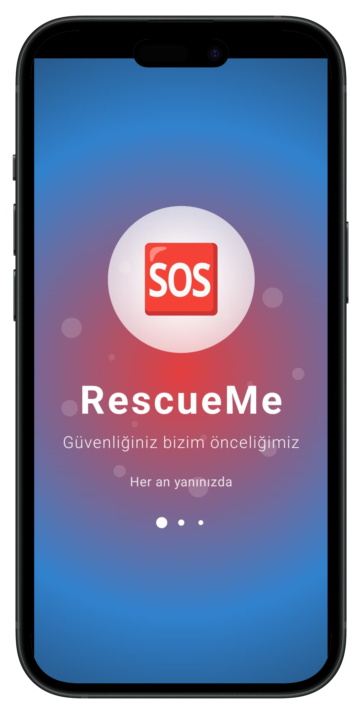
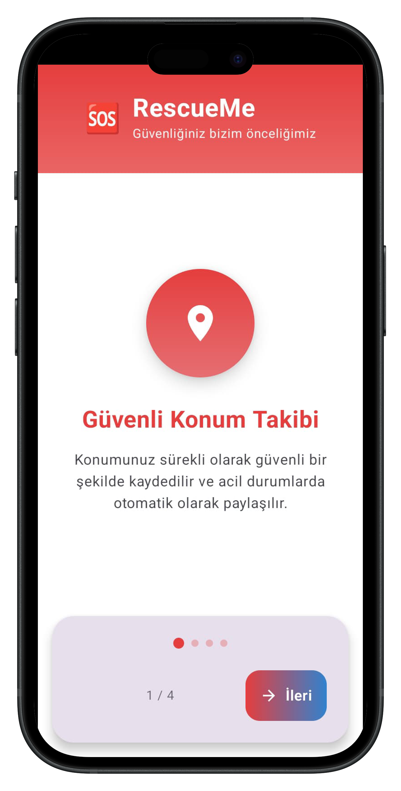
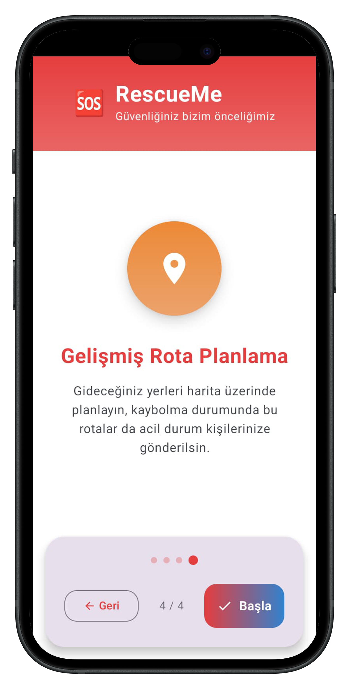
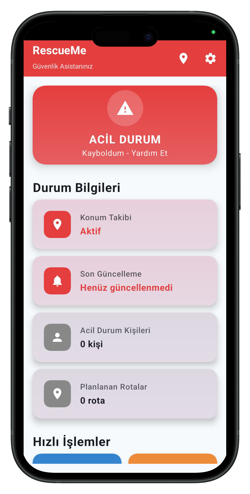
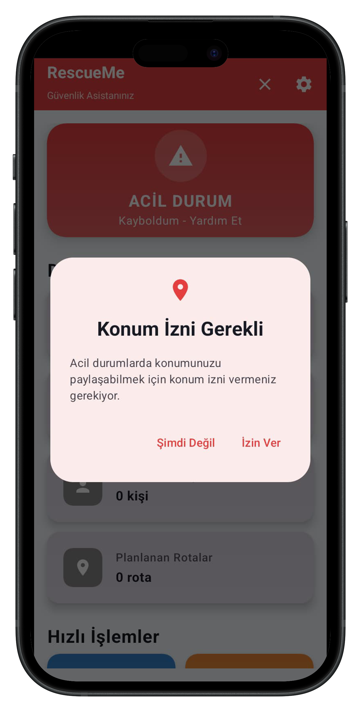
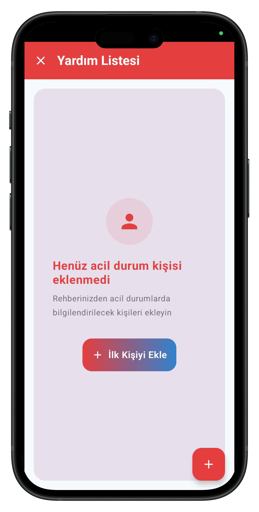
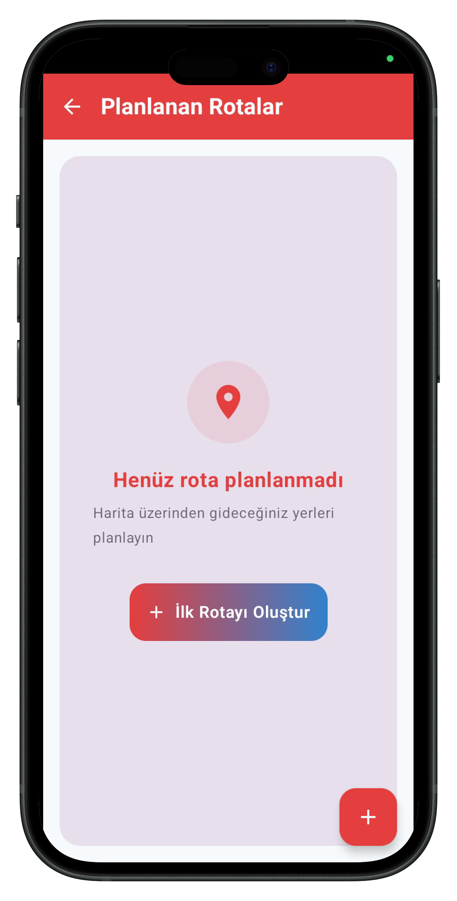
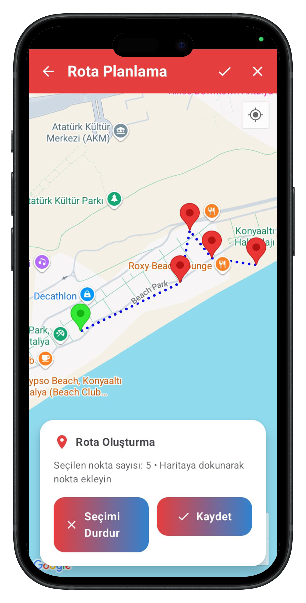
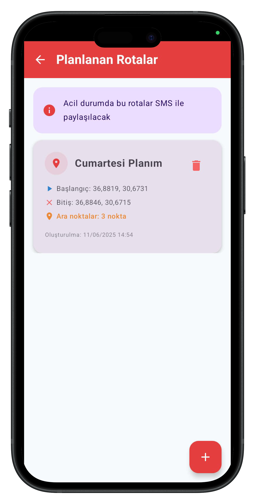
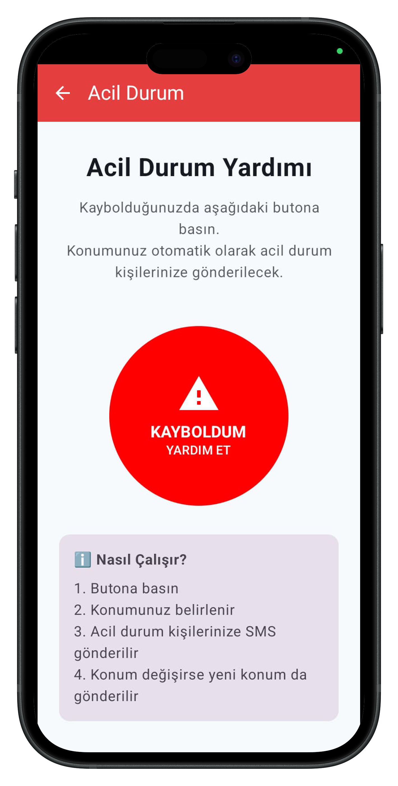

## 🆘 RescueMe – Emergency Location & Route Sharing App

***RescueMe is a modern Kotlin Android app built with Jetpack Compose that helps users share their real-time location and planned routes with trusted contacts via SMS during emergency situations. Designed with user safety in mind, RescueMe ensures that loved ones are always informed about the user’s last known position and intended destination.*** 

### 📱 Key Features
- 📍 Real-Time Location Tracking

- Continuous GPS tracking in the background
  
- Foreground service with location notifications
  
- Efficient detection of location changes
  
- Location data persisted using SharedPreferences

### 🚨 Emergency Mode
- "I’m Lost" emergency button with pulse animations

- Automatically sends SMS with:

- Last known location

- Updated positions upon location change

- Planned routes (if added)

- Manages emergency status in real time

### 🗺️ Route Planning (Google Maps Integration)
- Interactive route creation using map markers

- Waypoint support and polyline path drawing

- Optionally save routes for emergency reference

- Route information included in SMS alerts

### ✉️ SMS Delivery System
- Sends actual SMS (no internet needed)

- Multipart message support for long texts

- Format includes location, routes, and user identity

- Test SMS functionality to ensure delivery

### 👥 Trusted Contact Management
- Add emergency contacts directly from the phonebook

- Friendly UI with relationship labeling (e.g., Mom, Friend)

- Contacts list with add/remove/test capabilities

- Custom contact picker dialog

### 🎨 Modern UI/UX
- Material 3 theming and design principles

- Animated splash screen

- Beautiful home screen with gradients and cards

- Clean, responsive emergency and map interfaces

### 🧱 Architecture & Tech Stack

- 🔁 MVVM with Repository Pattern

- ⚙️ Hilt for Dependency Injection

- 🌀 StateFlow & Jetpack Compose Integration

- 🧠 ViewModels for state management

- 🗃️ SharedPreferences for persistent data

- 🧩 Google Maps API

- 🔐 Granular permission handling

- 🧪 Robust error logging & edge case handling

### 📱 Screenshots  

  
  
  
  
  
  
  
  
  
  
  
  

